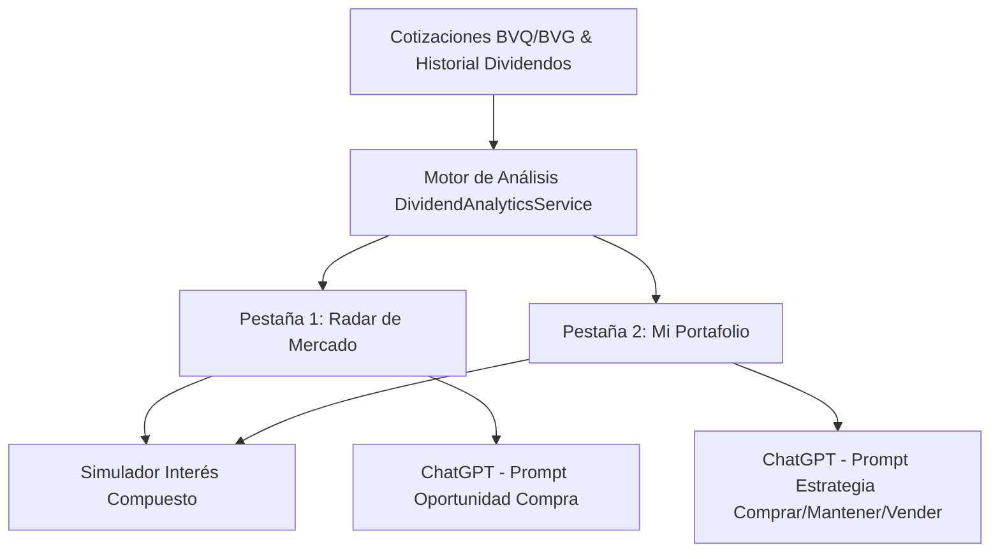

# 📡 Manual de Funcionalidad: Radar de Oportunidades & Portafolio de Renta Variable (Dividend Radar)

Este documento detalla el funcionamiento, la arquitectura técnica, las fórmulas financieras y los casos de uso prácticos con datos reales del módulo **Radar de Oportunidades & Portafolio de Renta Variable** de **SIPRO 07**.

---

## 📋 Índice
1. [Descripción General del Módulo](#1-descripción-general-del-módulo)
2. [Pestaña 1: Radar de Mercado (52+ Acciones Evaluadas)](#2-pestaña-1-radar-de-mercado)
3. [Pestaña 2: Mi Portafolio de Inversiones](#3-pestaña-2-mi-portafolio-de-inversiones)
4. [Simulador de Inversión e Interés Compuesto](#4-simulador-de-inversión-e-interés-compuesto)
5. [Consultas de IA con ChatGPT (Recomendaciones de Compra/Venta)](#5-consultas-de-ia-con-chatgpt)
6. [Glosario de Indicadores y Fórmulas Financieras](#6-glosario-de-indicadores-y-fórmulas-financieras)
7. [Ejemplos Prácticos con Datos Reales](#7-ejemplos-prácticos-con-datos-reales)

---

## 1. 🎯 Descripción General del Módulo

El **Radar de Oportunidades & Portafolio de Renta Variable** es una herramienta de análisis cuantitativo y gestión patrimonial diseñada para evaluar el mercado accionario de Ecuador (Bolsa de Valores de Quito y Guayaquil). 

Permite identificar acciones infravaloradas con alto rendimiento por dividendo (*Dividend Yield*), proyectar flujos futuros de caja pasivos, simular reinversión de utilidades e interactuar con Inteligencia Artificial (**ChatGPT**) para tomar decisiones de inversión.



---

## 2. 📊 Pestaña 1: Radar de Mercado

El **Radar de Mercado** evalúa continuamente más de 52 emisores accionarios cotizados en bolsa y los ordena por su **Dividend Yield (%) descendente**.

### 🛠️ Modos de Visualización:
- **Vista de Tarjetas Ejecutivas**: Cuadrícula de 4 tarjetas por fila con encabezado banner verde, métricas clave, promedios móviles técnicos (SMA 5, SMA 20) y botones de acción rápida.
- **Vista de Tabla Detallada**: Tabla con paginación, tooltips explicativos en cada encabezado y badges de estado.

### 📌 Tarjetas de Resumen KPI (Mercado):
1. **Emisores Evaluados**: Total de empresas cotizadas analizadas con historial de pago.
2. **Yield Promedio Mercado**: Promedio ponderado de rentabilidad por dividendo del mercado ecuatoriano.
3. **Top Dividend Yield**: Emisor con la tasa de rentabilidad por dividendo más alta.
4. **Pico de Cobro Anual**: Período del año con mayor concentración de pagos (Marzo - Mayo).

---

## 3. 💼 Pestaña 2: Mi Portafolio de Inversiones

Permite llevar el control detallado de las acciones que el inversionista o su grupo familiar mantiene actualmente en cartera.

### 🛠️ Características Principales:
- **Resumen Consolidado de Cartera**:
  - *Valor Total de Portafolio ($USD)*
  - *Dividendos Anuales Estimados ($USD/año)*
  - *Yield Promedio Ponderado (% Anual)*
  - *Cantidad de Posiciones Mantenidas*
- **Filtro por Titular de Cuenta**: Permite seleccionar a un miembro del grupo familiar o ver la vista **Consolidada por Emisor**.
- **Métricas por Posición**: Muestra las acciones mantenidas, el precio costo promedio de adquisición, capital invertido, valor de mercado actual, ganancia/pérdida no realizada ($ y %) y dividendos en efectivo cobrados.

---

## 4. 🧮 Simulador de Inversión e Interés Compuesto

Al hacer clic en el botón **`Simular`** de cualquier acción del Radar o Portafolio, se despliega una ventana modal interactiva:

1. **Entrada de Monto**: Permite ingresar un monto hipotético a invertir (ej. `$10,000 USD`).
2. **Resultados Inmediatos**:
   - Acciones a comprar según la cotización de cierre.
   - Dividendo anual estimado a recibir.
   - Yield estimado sobre la inversión.
3. **Proyección Multianual a 5 Años (Efecto Interés Compuesto)**:
   Muestra año a año el crecimiento exponencial del portafolio mediante la reinversión del 100% de los dividendos en nuevas acciones de la misma compañía.

---

## 5. 🤖 Consultas de IA con ChatGPT

Cada acción cuenta con un botón **`ChatGPT`** que genera un análisis cuantitativo estructurado listo para ser procesado por inteligencia artificial.

### 🔀 Lógica de Prompts Diferenciada:

#### A. Desde el Radar de Mercado (Evaluación de Nueva Compra):
* **Propósito**: Determinar si conviene iniciar una posición en la acción.
* **Prompt Generado**: Incluye precio actual, dividendo D1, Gordon Fair Value, % de revalorización, promedios móviles e indicadores de liquidez.
* **Veredicto Solicitado a ChatGPT**: `COMPRAR / MANTENER / ESPERAR UN MEJOR PRECIO`.

#### B. Desde Mi Portafolio (Gestión de Posición Existente):
* **Propósito**: Determinar la estrategia adecuada para una inversión que el usuario **ya posee**.
* **Prompt Generado**: Añade titular, cantidad de acciones mantenidas, precio costo promedio de compra, ganancia/pérdida no realizada ($ y %) y dividendos cobrados.
* **Veredicto Solicitado a ChatGPT**: `COMPRAR MÁS (Promediar) / MANTENER (Hold) / VENDER TOTAL O PARCIALMENTE`.

---

## 6. 📐 Glosario de Indicadores y Fórmulas Financieras

| Indicador / Columna | Fórmula | Descripción Financiera |
| :--- | :--- | :--- |
| **Precio Mercado ($)** | `Cotización Cierre` | Último precio de transacción por acción registrado en los boletines de bolsa ($/acción). |
| **Último Dividendo ($)** | `D_0` | Dividendo en efectivo entregado por la compañía en su junta reciente. |
| **Dividendo Proyectado ($D_1$)** | `D_1 = D_0 &times; (1 + g)` | Dividendo estimado a 12 meses aplicando crecimiento constante $g = 3\%$. |
| **Dividend Yield (%)** | `(D_0 / Precio) &times; 100%` | Rendimiento porcentual del flujo en efectivo que recibe el inversionista sobre el capital invertido. |
| **Consistencia Histórica** | `Rating ★★★★★` | Rating de 1 a 5 estrellas según los años consecutivos entre 2020 y 2026 con pago de dividendos. |
| **Valor Justo Gordon ($P_0$)** | `P_0 = D_1 / (r - g)` | Valor intrínseco teórico por el Modelo de Gordon Growth (DDM), con $r = 10\%$ y $g = 3\%$. |
| **% Oportunidad Revalorización** | `((P_0 - Precio) / Precio) &times; 100%` | Margen de seguridad o potencial porcentual de apreciación de la acción. |

---

## 7. 💡 Ejemplos Prácticos con Datos Reales del Mercado

A continuación se presentan 3 casos reales de empresas cotizadas en el mercado ecuatoriano analizadas a través del Radar de SIPRO 07:

---

### 🟢 Ejemplo 1: **MERIZA** (Alta Oportunidad por Dividend Yield)

#### 📊 Datos Cuantitativos de Mercado:
* **Precio Mercado ($):** `$24.00 USD` / acción
* **Último Dividendo Pagado ($):** `$11.00 USD` / acción
* **Dividendo Proyectado ($D_1$):** `$11.33 USD` / acción ($11.00 \times 1.03$)
* **Dividend Yield (%):** **`45.83% Anual`**
* **Valor Justo Gordon ($P_0$):** **`$161.86 USD`** ($11.33 / (0.10 - 0.03)$)
* **% Oportunidad Revalorización:** **`+574.40%`**
* **Histórico Dividendos:** 9 pagos registrados | Mes probable: Marzo

#### 🤖 Consulta Generada para ChatGPT:
```text
Actúa como un experto analista financiero sénior del Mercado de Valores de Ecuador. 
Analiza los datos de MERIZA:
• Precio Actual: $24.00 | Último Dividendo: $11.00 | Yield: 45.83% Anual
• Valor Justo Gordon: $161.86 | % Oportunidad: +574.40%
¿Cuál es la recomendación de compra y cuáles son los riesgos a considerar?
```

#### 💡 Resultado del Análisis:
* **Veredicto:** **COMPRAR**. 
* **Justificación:** MERIZA ofrece una rentabilidad por dividendo del 45.83% anual, lo que permite recuperar el 100% del capital invertido en menos de 2.5 años solo por vía dividendos. Además, cotiza con un descuento profundo respecto a su valor intrínseco teórico descontado.

---

### 🔵 Ejemplo 2: **CEPSA** (Consistencia ★★★★★ y Alta Liquidez)

#### 📊 Datos Cuantitativos de Mercado:
* **Precio Mercado ($):** `$1.00 USD` / acción
* **Último Dividendo Pagado ($):** `$0.4078 USD` / acción
* **Dividendo Proyectado ($D_1$):** `$0.4200 USD` / acción
* **Dividend Yield (%):** **`40.78% Anual`**
* **Consistencia Histórica:** **`★★★★★ (5 de 5 años pagando continuos)`**
* **Valor Justo Gordon ($P_0$):** **`$6.00 USD`**
* **% Oportunidad Revalorización:** **`+500.02%`**
* **Histórico Dividendos:** 16 pagos registrados | Rating Riesgo: AAA

#### 🧮 Simulación de Inversión ($10,000 USD):
- **Acciones Compradas:** `10,000 acciones`
- **Ingreso Anual Estimado:** `$4,078.00 USD / año`
- **Proyección a 5 Años con Reinversión de Dividendos:**

| Año | Acciones Acumuladas | Dividendo Recibido (USD) | Acciones Reinvertidas | Valor Estimado Portafolio (USD) |
| :---: | :---: | :---: | :---: | :---: |
| **Año 1** | 10,000 | $4,078.00 | +4,078 acc | $14,078.00 |
| **Año 2** | 14,078 | $5,913.43 | +5,913 acc | $19,991.00 |
| **Año 3** | 19,991 | $8,574.00 | +8,574 acc | $28,565.00 |
| **Año 4** | 28,565 | $12,437.00 | +12,437 acc | $41,002.00 |
| **Año 5** | 41,002 | $18,039.00 | +18,039 acc | **$59,041.00** |

> **Resultado:** Una inversión inicial de **$10,000 USD** se convierte en **$59,041.00 USD** al cabo de 5 años mediante el interés compuesto de reinversión de dividendos.

---

### 🟡 Ejemplo 3: **PRODUBANCO (BANCO DE LA PRODUCCIÓN S.A.)** (Posición en Mi Portafolio)

#### 💼 Datos de la Posición en Portafolio:
* **Titular:** Juan Pérez
* **Acciones Mantenidas:** `10,000 acciones`
* **Precio Costo Promedio Compra:** `$0.85 USD` / acción
* **Precio Cotización Actual:** `$1.00 USD` / acción
* **Capital Invertido:** `$8,500.00 USD`
* **Valor Mercado Actual:** `$10,000.00 USD`
* **Ganancia No Realizada:** **`+$1,500.00 USD (+17.65%)`**
* **Dividendos Cobrados Históricamente:** `$407.80 USD`
* **Calificación de Riesgo:** **`AAA- (Bankwatch Ratings del Ecuador S.A.)`**

#### 🤖 Consulta Generada para ChatGPT (Estrategia Portafolio):
```text
Actúa como un experto gestor de portafolios en Ecuador.
Evalúa mi posición en PRODUBANCO:
• Mantenidas: 10,000 acciones | Costo Promedio: $0.85 | Precio Actual: $1.00
• Ganancia No Realizada: +$1,500.00 (+17.65%) | Dividendos Cobrados: $407.80
• Rating de Riesgo: AAA- (Bankwatch) | Yield Actual: 40.78% Anual
¿Debo COMPRAR MÁS, MANTENER o VENDER para realizar ganancias?
```

#### 💡 Resultado del Análisis:
* **Veredicto:** **MANTENER (HOLD) / COMPRAR MÁS EN CAÍDAS**.
* **Justificación:** La posición genera un rendimiento anual por dividendo del 40.78% sobre el precio actual y un **47.97% Yield on Cost** sobre el costo de adquisición ($0.85). Vender la posición significaría renunciar a un flujo pasivo recurrente de $407.80/año respaldado por una entidad financiera con calificación **AAA-**.

---

## 📌 Conclusión

El **Radar de Oportunidades & Portafolio de Renta Variable** unifica la valoración cuantitativa (Gordon DDM), la gestión de portafolio personal, la proyección de interés compuesto y la inteligencia artificial en un solo flujo de trabajo eficiente para el inversionista en Ecuador.
