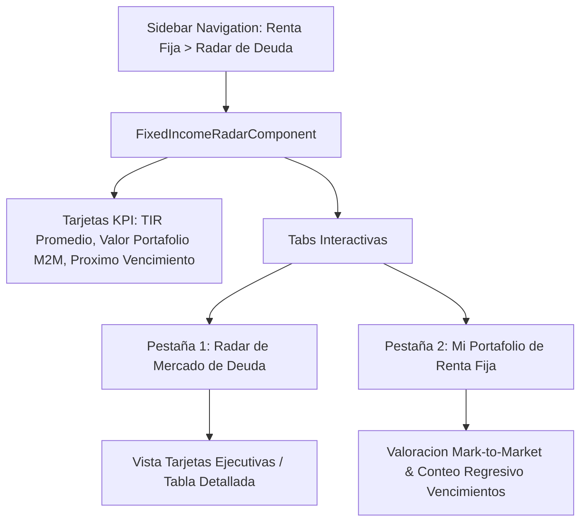
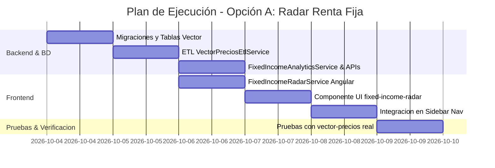

# 📋 Plan de Implantación: Módulo "Renta Fija & Portafolio de Deuda" (Opción A)

Este plan detalla los pasos, la arquitectura técnica, las estructuras de base de datos y la interfaz gráfica para implementar el **Radar de Renta Fija & Portafolio de Deuda** en **SIPRO 07**, utilizando como fuente primaria el archivo **`vector-precios-diario.xls`** expedido por la Bolsa de Valores de Quito (BVQ).

---

## 🎯 1. Objetivos del Módulo
1. **Valoración a Precios de Mercado (*Mark-to-Market*)**: Actualizar el valor patrimonial real de cada bono, obligación o papel comercial en la cartera del usuario según la cotización oficial de la bolsa.
2. **Cálculo de Plusvalía / Minusvalía No Realizada**: Medir el impacto de las variaciones de tasas de mercado en el valor de la cartera ($ y %).
3. **Monitoreo de Vencimientos (`PLAZO POR VENCER`)**: Visualizar los días remanentes para la maduración del capital principal.
4. **Radar de Mercado de Deuda**: Identificar emisiones corporativas y soberanas atractivas según su **TIR (%)** y **Calificación de Riesgo**.

---

## 📐 2. Arquitectura de Datos y Migraciones Backend (Laravel)

### 🗄️ 2.1 Tabla: `vector_precio_diario`
Creación de la tabla para almacenar la matriz diaria de valoración de la BVQ (1,111+ títulos por fecha):

| Campo | Tipo | Descripción |
| :--- | :--- | :--- |
| `id` | `BIGINT AUTO_INCREMENT` | Identificador único |
| `fecha_vector` | `DATE` | Fecha del boletín bursátil (ej. `2026-10-03`) |
| `codigo_titulo_vector` | `VARCHAR(30)` | Código ISIN / BVQ con prefijo `'a'` (ej. `a333010100001270830`) |
| `emisor_nombre` | `VARCHAR(255)` | Nombre del emisor |
| `tipo_instrumento` | `VARCHAR(100)` | Obligación, Papel Comercial, Titularización, Bono Estado |
| `precio_porcentaje` | `DECIMAL(10, 4)` | Precio de valoración en porcentaje par (ej. `102.5000%`) |
| `tir_descuento` | `DECIMAL(8, 4)` | Tasa Interna de Retorno de mercado (% TIR) |
| `tasa_cupon` | `DECIMAL(8, 4)` | Tasa de interés nominal de la emisión |
| `plazo_dias_remanentes` | `INT` | Días exactos para el vencimiento |
| `calificacion_riesgo` | `VARCHAR(20)` | Rating crediticio (AAA, AA+, AA, A, etc.) |
| `fecha_vencimiento` | `DATE` | Fecha exacta de vencimiento del título |
| `created_at` / `updated_at` | `TIMESTAMP` | Marcas de tiempo de auditoría |

---

### ⚙️ 2.2 Servicio ETL y Comando Artisan
* **Servicio `VectorPreciosEtlService.php`**:
  * Parsea las 3 pestañas del Excel (`Precios`, `Notas`, `Curva de Rendimiento`).
  * Homologa el campo `CODIGO_TITULO` anteponiendo el prefijo `'a'`.
  * Indexa las calificaciones de riesgo y los días remanentes.
* **Comando Artisan `sipro:import-vector-precios`**:
  * Ejecución: `php artisan sipro:import-vector-precios [ruta_archivo]`

---

### 🌐 2.3 Servicios & Controladores API Backend

#### **`FixedIncomeAnalyticsService.php`**
Implementa la lógica financiera de Renta Fija:

1. **`getMarketRadar(filters)`**:
   - Devuelve todas las emisiones cotizadas en el Vector de Precios.
   - Calcula métricas globales (TIR Promedio del Mercado, Plazo Promedio, Emisiones por Calificación de Riesgo).

2. **`getUserPortfolioMarkToMarket(user_id, account_id)`**:
   - Cruza las inversiones vigentes (`sipro_desa.inversion`) con el último `vector_precio_diario`.
   - **Fórmulas Aplicadas**:
     - $\text{Valor Compra (\$)} = \text{Monto Invertido Original}$
     - $\text{Valor Mercado Actual (\$)} = \text{Monto Invertido} \times \left(\frac{\text{Precio Vector \%}}{\text{Precio Compra \%}}\right)$
     - $\text{Ganancia / Pérdida No Realizada (\$)} = \text{Valor Mercado Actual} - \text{Valor Compra}$
     - $\text{Ganancia / Pérdida (\%)} = \left(\frac{\text{Ganancia \$}}{\text{Valor Compra}}\right) \times 100\%$

#### **`FixedIncomeRadarController.php`**
- `GET /api/renta-fija-radar/mercado`
- `GET /api/renta-fija-radar/portafolio`
- `POST /api/renta-fija-radar/importar-vector`

---

## 🎨 3. Diseños e Interfaz Gráfica Frontend (Angular + PrimeNG)

El módulo se construirá con la **misma estética ejecutiva y estructura gemela al Radar de Dividendos**:

### 🖥️ Vistas del Componente:
1. **Header & KPI Summary**:
   - **TIR Promedio Mercado**: Rendimiento ponderado de la deuda activa.
   - **Valor Portafolio M2M**: Valor total a precio de mercado de la cartera de Renta Fija.
   - **Variación No Realizada**: Plusvalía o minusvalía neta en dólares y porcentaje.
   - **Próximo Vencimiento**: Título más cercano a vencer (días remanentes).

2. **Pestaña 1: Radar de Mercado (Deuda Corporativa y Soberana)**:
   - Tarjetas ejecutivas con banner de calificación de riesgo (AAA en verde, AA en azul, A en amarillo).
   - Detalle de Tasa Nominal Cupón vs TIR de Descuento de Mercado.
   - Barra de progreso visual del tiempo remanente al vencimiento.

3. **Pestaña 2: Mi Portafolio de Deuda (Mark-to-Market)**:
   - Filtro por titular de cuenta (o consolidado).
   - Comparativo de Precio de Compra vs Precio Vector Actual.
   - Estado de la plusvalía no realizada con badges en verde `+$... (+...%)` o rojo.
   - Conteo regresivo de días para el cobro del principal.

---

## 📅 4. Fases de Ejecución

---

## 🔄 5. Criterios de Aceptación y Verificación

1. **Precisión del MTM**: La valoración Mark-to-Market de un bono del $100.00\%$ comprado a la par que cotiza a $103.54\%$ debe reflejar exactamente $+3.54\%$ de plusvalía no realizada.
2. **Homologación de Códigos**: Verificación de que el prefijo `'a'` permita la búsqueda exacta de 1,111+ instrumentos sin perdidas de ceros a la izquierda.
3. **Estabilidad Visual**: Soporte completo para vistas de tabla y tarjetas ejecutivas responsivas con PrimeNG/Bootstrap 5.
4. **Build Limpio**: Verificación de compilación en Angular sin advertencias ni errores.

---
