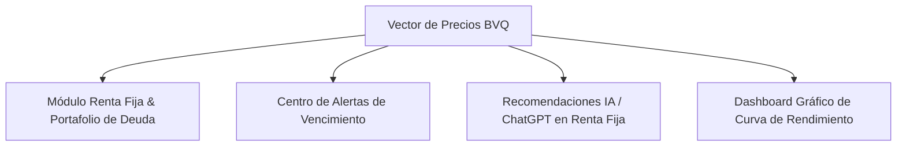

# 📊 Propuesta Técnica y Funcional: Explotación del Vector de Precios Diario (BVQ) en SIPRO 07

Este documento detalla la estrategia para integrar y explotar la información contenida en el archivo **`vector-precios-diario.xls`** expedido por la Bolsa de Valores de Quito (BVQ), transformando a **SIPRO 07** en una suite integral de inteligencia bursátil para **Renta Fija** y **Renta Variable**.

---

## 📌 1. Estrategia del Prefijo `'a'` en `codigo_titulo_vector`

### 💡 Justificación Técnica:

En la base de datos `sipro_desa.instrumento`, el campo **`codigo_titulo_vector`** almacena el código ISIN / BVQ de 18 dígitos con la letra `'a'` antepuesta (ejemplo: `a333010100001270830`).

* **Ventaja:** En PHP, Python, JavaScript y motores SQL, los códigos numéricos largos (como `333010100001270830`) corren el riesgo de ser truncados, convertidos a notación científica (`3.3301E+17`) o despojados de sus ceros a la izquierda. La letra `'a'` inicial garantiza el tratamiento estricto del campo como cadena de texto (`VARCHAR`).
* **Regla ETL de Homologación:** En el motor ETL de SIPRO, la coincidencia entre la tabla `instrumento` y la columna `CÓDIGO TÍTULO` del archivo de la BVQ se realiza mediante:
  
  ```sql
  -- Opción SQL / Query Builder:
  WHERE LTRIM(instrumento.codigo_titulo_vector, 'a') = vector_excel.codigo_titulo
  -- o concatenando en PHP:
  $codigoMap = 'a' . trim($filaExcel['CODIGO_TITULO']);
  ```

---

## 🎯 2. Valor Estratégico del Archivo `vector-precios-diario.xls`

Mientras que las cotizaciones diarias alimentan la **Renta Variable (Acciones y Dividendos)**, el archivo `vector-precios-diario.xls` de la BVQ es la **fuente oficial de valoración a precios de mercado (*Mark-to-Market*) para Renta Fija**.

### 📄 Pestañas que Conforman el Archivo:

1. **`Precios` (1,111 instrumentos)**: Matriz de valoración diaria de Obligaciones, Papel Comercial, Titularizaciones y Bonos del Estado con sus precios porcentuales, calificaciones de riesgo, tasas de descuento y días remanentes.
2. **`Notas` (1,289 registros)**: Resumen de hechos relevantes, ajustes metodológicos de spreads y resoluciones de la Comisión Nacional de Valores (CNV).
3. **`Curva de Rendimiento` (10,801 puntos)**: Curva cupón cero de rendimiento del mercado ecuatoriano desde el **Día 1 hasta el Día 10,800 (30 Años)**.

---

## 🔍 3. Casos de Uso Concretos en SIPRO 07

1. **Valoración a Precios de Mercado (*Mark-to-Market*)**:
   Determina el valor razonable actualizado de cada título o bono en el portafolio del usuario si fuera negociado en la bolsa hoy.
2. **Cálculo de Plusvalía o Minusvalía No Realizada en Renta Fija**:
   Compara el precio de adquisición del título (ej. `100.00%` par) contra el precio del vector (ej. `103.54%`), reflejando la ganancia no realizada por variación de tasas de mercado.
3. **Control Regresivo de Vencimientos (`PLAZO POR VENCER`)**:
   Monitorea exactamente cuántos días faltan para la maduración y devolución del capital principal.
4. **Referencial de Tasas mediante la Curva Cupón Cero**:
   Compara el rendimiento de las inversiones privadas contra la tasa oficial del mercado bursátil.

---

## 🚀 4. Opciones de Módulos y Funcionalidades a Implementar



### 📊 Opción A: Módulo "Renta Fija & Portafolio de Deuda" (Vista Gemela al Radar de Dividendos)

* **Visualización en Tarjetas y Tabla Ejecutiva**:
  - Muestra la posición en Obligaciones, Papel Comercial o Titularizaciones con:
    - *Precio Compra vs Precio Vector Mercado*
    - *Tasa Cupón Nominal vs TIR de Descuento de Mercado*
    - *Días Remanentes al Vencimiento (con barra de progreso)*
    - *Ganancia / Pérdida por variación de precio porcentual*
    - *Insignia de Calificación de Riesgo Crediticio (AAA, AA+, etc.)*

### 🔔 Opción B: Centro de Alertas y Conteo Regresivo de Vencimientos

* **Sistema de Notificaciones Automatizado**:
  - Notificaciones en el Dashboard cuando una inversión en Renta Fija esté a `< 30 días` o `< 90 días` de su vencimiento final o cobro de cupón, basado en la columna `PLAZO POR VENCER`.

### 🤖 Opción C: Recomendaciones con ChatGPT para Renta Fija

* **Prompt Especializado para Deuda Corporativa y Soberana**:
  - Incorpora un botón **ChatGPT** en cada título de Renta Fija para evaluar opciones de inversión o venta:
    
    > *"Tengo una Obligación de ADELCA (Rating AAA) comprada al 100% con tasa cupón 6.25% y le quedan 598 días al vencimiento. El precio de mercado actual en el vector es 100.23% (TIR 6.15%). ¿Me conviene conservarla para cobrar los cupones o venderla en bolsa hoy para tomar ganancias?"*

### 📈 Opción D: Gráfico Interactivo de la Curva de Rendimiento Cero Cupón

* **Widget en Dashboard Financiero**:
  - Renderiza un gráfico de líneas interactivo con la **Curva de Rendimiento Cero Cupón del Mercado Ecuatoriano** (Plazo en Días vs Tasa TIR %), permitiendo al usuario ubicar sus títulos en la curva y comparar su rendimiento frente al mercado.

---

## 📌 Próximos Pasos Recomendados

1. **Guardar esta propuesta en el directorio de documentación del proyecto** (`docs/propuesta_explotacion_vector_precios_bvq.md`).
2. **Seleccionar las Opciones prioritarias (ej. Opción A y Opción C)** para estructurar el siguiente plan de desarrollo.
